# ticketing demo for didcon

#idcon vol.28 DID特集その2 - その名も"#didcon"のチケットをVerifiable Credentials/Decentralized Identifiersで受け取ろう  

※重要
connpassとの連携は全くないので、正規の申し込みはconnpassからしてくださいね。  
[https://idcon.connpass.com/event/191305/](https://idcon.connpass.com/event/191305/)

## News
* <s>11/18夕方現在、Microsoft Authenticatorのバックエンドシステムで障害が発生している模様です。ブラウザWalletをお使いください。復旧が確認出来次第情報を更新します。</s>

## やれること
didconということで以下をやってみました。
* Verifiable Credentialsの形式で参加チケットを発行します
* 参加チケットを提示すると配信URL（Zoom）が表示されます

## 事前準備
* WalletとしてMicrosoft Authenticatorもしくはブラウザで動作するカスタムWalletの2つをサポートしています。    
    * Microsoft Authenticator
        * Android版のみ
        * 最新版：6.2010.7266
        * beta programの有効化が必要
        * アプリのHELP画面からバージョンの確認、beta programへの参加ができます。  
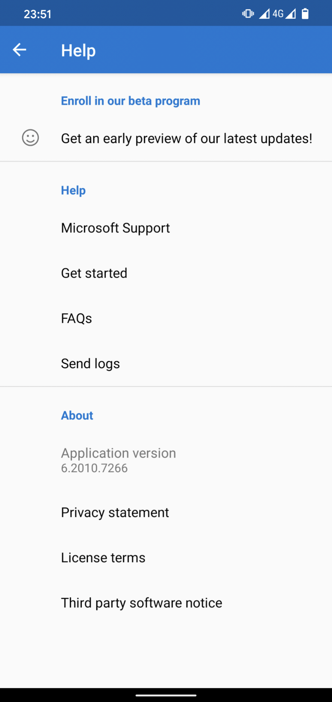  
        * beta programに参加するには"Enroll in our beta program"の下の"Get an early preview of our latest updates!"をタップします。ベータプログラムに参加すると以下の様に表示されます。  
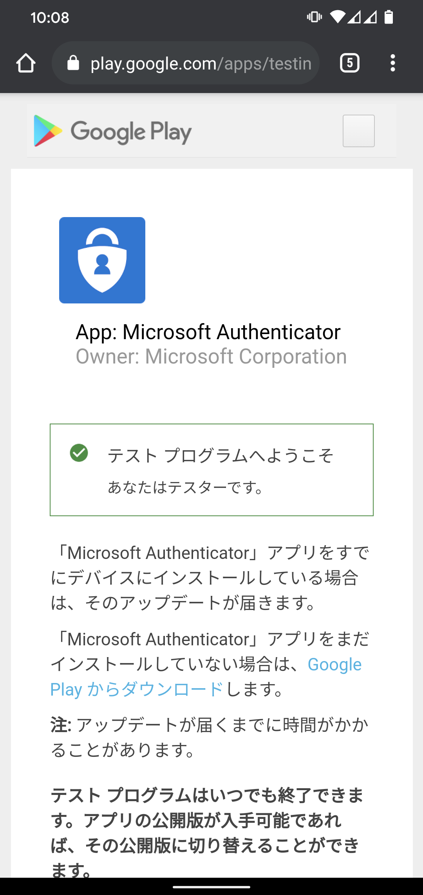  

    * ブラウザベースで動作するカスタムWallet
        * スマホのブラウザ（iOSはSafariのみ、AndroidはChromeのみ）で以下のURLにアクセスしてください。  
[https://browser-wallet.azurewebsites.net](https://browser-wallet.azurewebsites.net)

## チケットを発行する
以下のWebページでチケットを発行しています。（ID登録が必要です）  
[https://i.didcon.tokyo/](https://i.didcon.tokyo/)

* "Get your #didcon Ticket"と書かれたボタンをクリックします。  
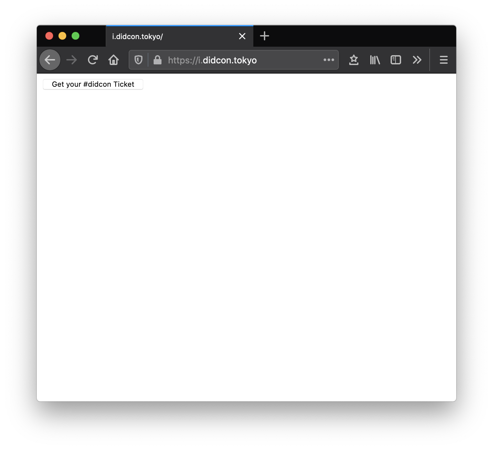
* QRコードが表示されるのでWallet（Microsoft AuthenticatorもしくはブラウザWallet）で読み取ります。  
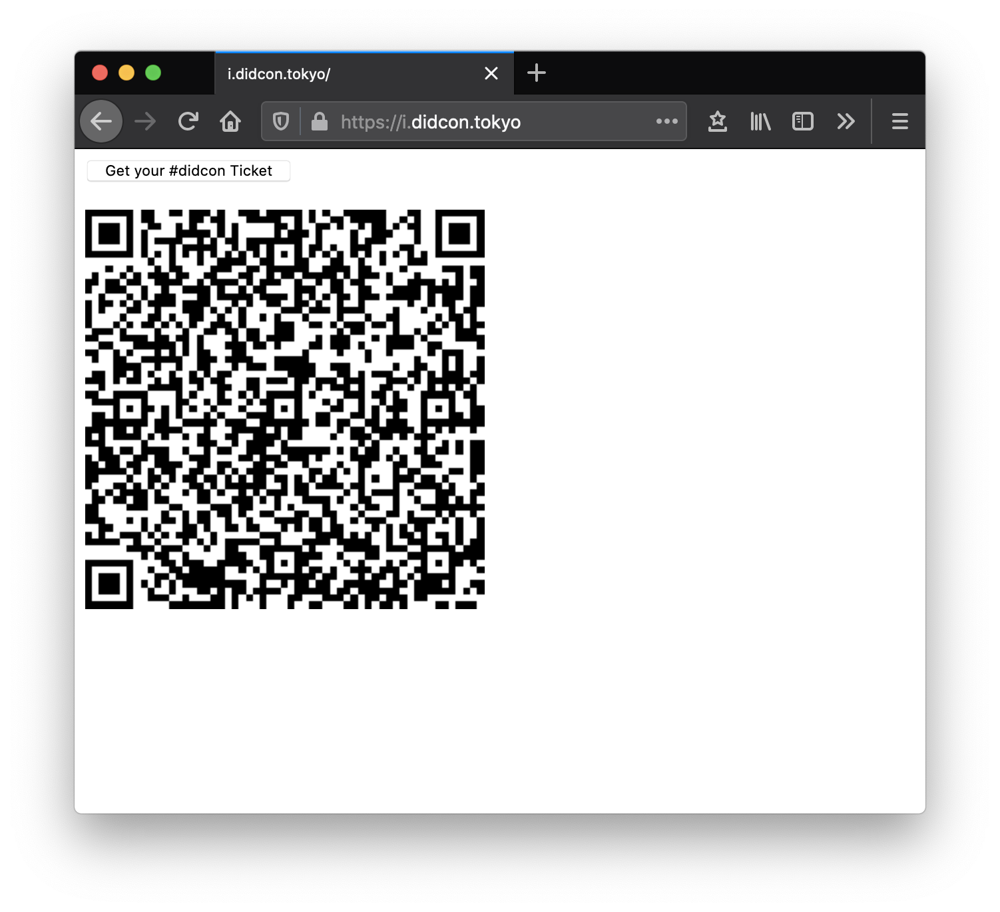
    * Microsoft Authenticatorを使っている場合は画面右肩より"Add account”、”Other account"を選択し、QRコードリーダーを起動できます。
    * ブラウザWalletを使っている場合は画面右上のアイコンをタップしてカメラを起動します。（カメラへのアクセス許可が要求されるので許可してください）  
    以下、ブラウザWalletを例に進めます。
* チケットが表示されるのでnfpoc.b2clogin.comへログインします。  
  
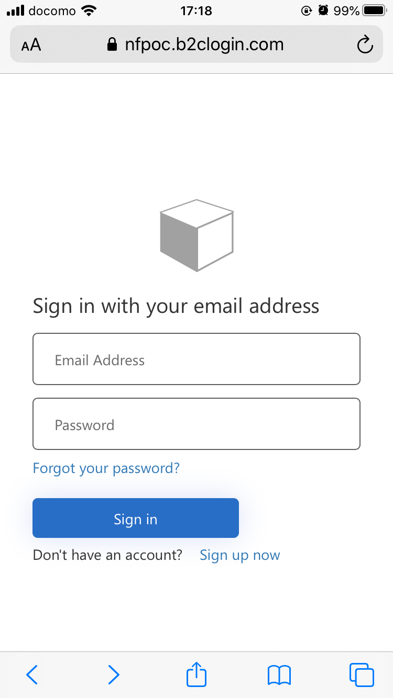  
* 初回はアカウントがないので、Sign up nowをクリックしてアカウントを作成します。  
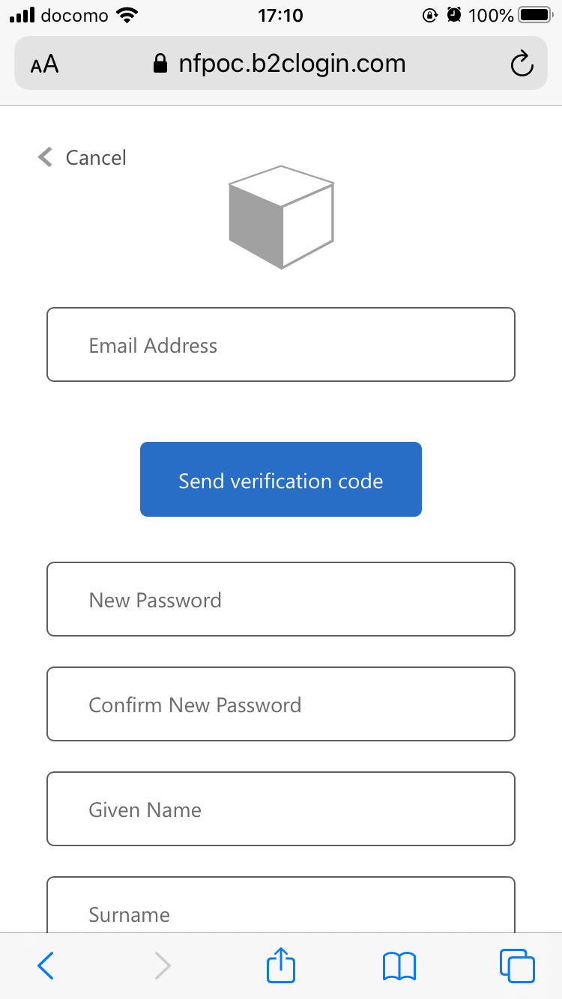
    * メールアドレスを入れてSend verification codeをタップすると確認コードがメールで届くので入力してください。
    * パスワード、姓、名を入れてCreateをタップするとユーザ作成〜ログインが完了します。

* サインインが完了するとチケットが再度表示されるのでSubmitしてWalletにチケットを格納します。  
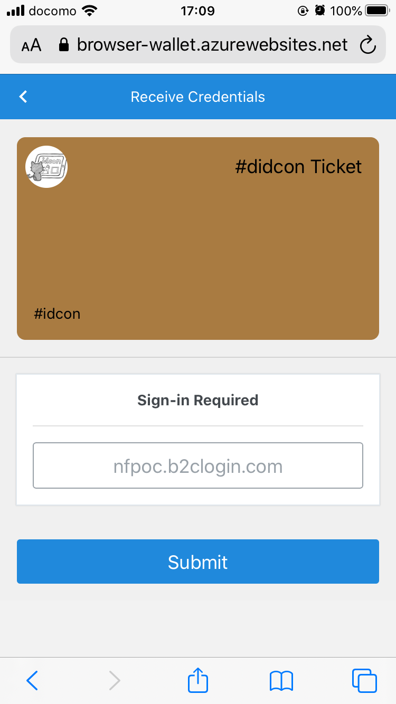
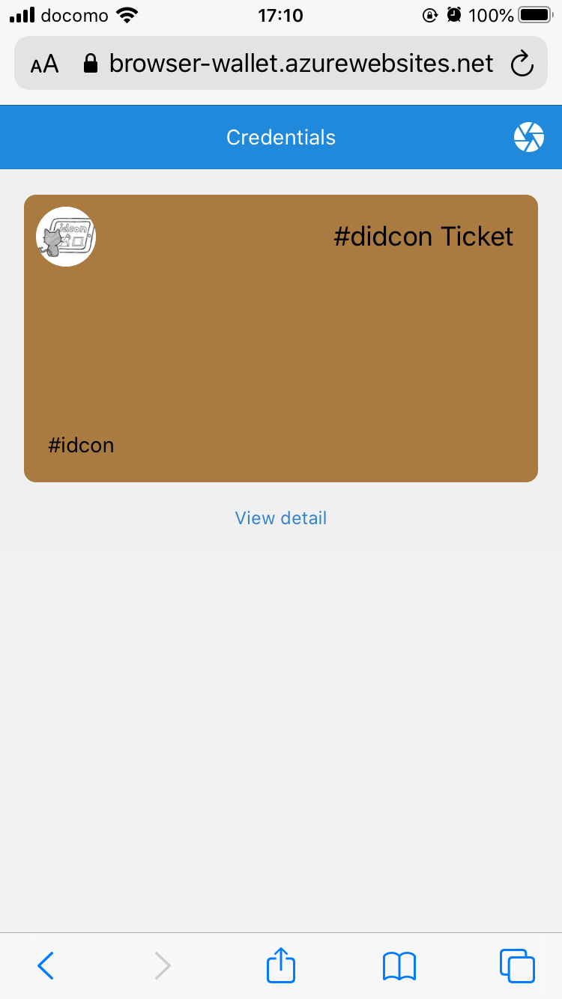

## チケットを検証する
以下のWebページでチケットの検証と配信用Zoom URLを発行しています。
[https://v.verifier.tokyo/](https://v.verifier.tokyo/)  

* "Provide your #didcon ticket!"と書かれたボタンをクリックします。  
  
* QRコードが表示されるのでWallet（Microsoft AuthenticatorもしくはブラウザWallet）で読み取ります。  
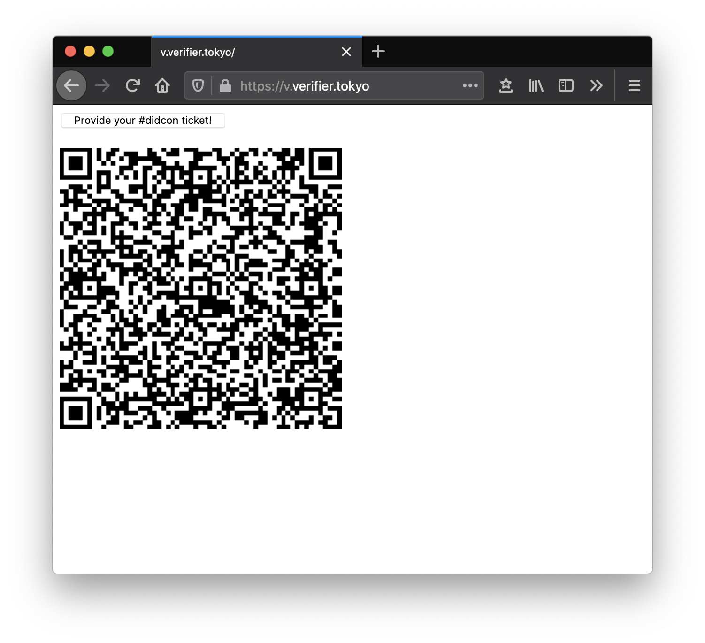  
* チケットが表示されるのでSubmitをタップします。  
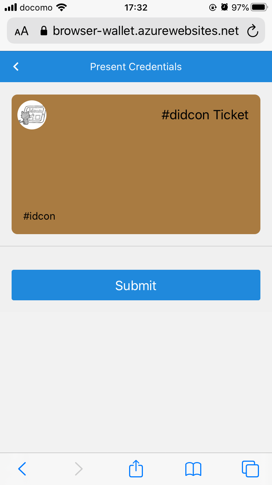  
* ブラウザのQRコードの下にZoomのリンクが現れるのでZoomでdidconにご参加ください。  
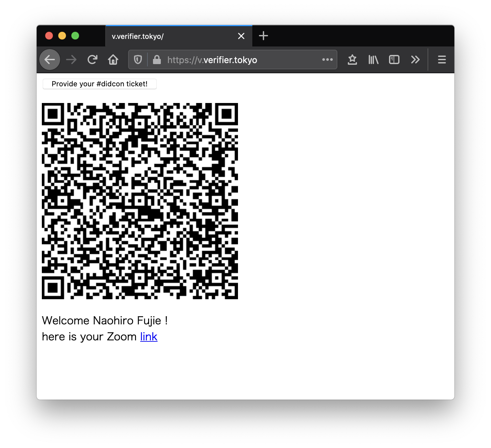  

